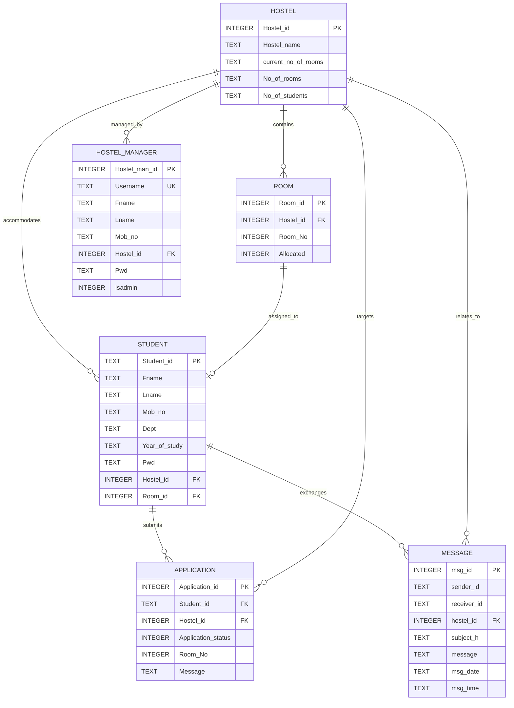

# NIT Calicut — Hostel Room Allocation & Management System (HMS)
# Complete Technical Specification & System Documentation Report

**Document Version:** 2.0.0  
**Project Category:** University Housing Management & Room Allocation Portal  
**Target Environment:** Node.js (v18+) / SQLite3 / Modern Web Browsers  
**Default Port:** `http://localhost:5000`  
**Date of Publication:** October 2026  

---

## Table of Contents
1. [Executive Summary & System Objectives](#1-executive-summary--system-objectives)
2. [Technology Stack & Languages In-Depth](#2-technology-stack--languages-in-depth)
3. [System Architecture & Design Patterns](#3-system-architecture--design-patterns)
4. [File & Directory Structure](#4-file--directory-structure)
5. [Database Design & Data Dictionary](#5-database-design--data-dictionary)
6. [API Specification & Endpoints](#6-api-specification--endpoints)
7. [User Roles, Features & Workflows](#7-user-roles-features--workflows)
8. [Security & Optimization Measures](#8-security--optimization-measures)
9. [Installation, Setup & User Guide](#9-installation-setup--user-guide)
10. [Test Accounts & Verification Scenarios](#10-test-accounts--verification-scenarios)

---

## 1. Executive Summary & System Objectives

The **Hostel Room Allocation and Management System (HMS)** is a full-stack web platform engineered to automate and streamline the residential management of university hostel facilities. Built specifically around the administrative requirements of university hostels (originating from NIT Calicut), the platform addresses common challenges associated with paper-based and disjointed room allocation processes:

- **Automated Room Inventory**: Real-time tracking of total rooms, occupied rooms, and vacancies across multiple residential blocks.
- **Self-Service Student Workflows**: Online registration, profile management, and direct room requests with custom preference messages (such as ground-floor medical preferences).
- **Administrative Decision Engine**: Hostel managers and wardens can review pending requests, allocate specific room numbers, reject incompatible applications, and vacate rooms when students graduate or relocate.
- **In-App Communication Hub**: Dedicated notification and query exchange mechanism between residents and hostel management.

---

## 2. Technology Stack & Languages In-Depth

### 2.1 Programming Languages

| Language | Layer | Description & Scope |
| :--- | :--- | :--- |
| **JavaScript (ES6+)** | **Backend & Frontend** | - **Backend**: Runs on Node.js using modern async/await patterns, Express route handlers, bcrypt password encryption, and promisified SQLite database operations.<br>- **Frontend**: Powers client-side view routing, form validation, dynamic DOM rendering, async HTTP communication via `fetch()`, and local storage session control. |
| **HTML5** | **Presentation Layer** | Semantic markup (`<header>`, `<nav>`, `<main>`, `<section>`, `<aside>`), accessible input types, modal containers, and cache-busting meta headers. |
| **CSS3** | **Styling & User Experience** | Modern design system utilizing CSS Custom Properties (Variables), Flexbox, CSS Grid layouts, Glassmorphism backdrop filters (`backdrop-filter: blur(16px)`), and media queries for responsive mobile/desktop rendering. |
| **SQL (SQLite3 Dialect)** | **Data Persistence** | Relational schema definitions, primary keys, foreign key constraints (`CASCADE` & `SET NULL`), index creation, and parameterized SQL queries. |
| *PHP 7.x (Legacy)* | *Archived* | Legacy procedural PHP scripts originally developed for early NIT Calicut coursework, now safely isolated in `legacy_php/`. |

### 2.2 Frameworks & Runtime Libraries

- **Node.js (v18.x - v22.x)**: Event-driven, non-blocking I/O runtime providing high throughput and low memory footprint.
- **Express.js (v4.19.2)**: Minimalist backend web framework:
  - Dispatches REST API requests (`/api/*`).
  - Delivers static files (`public/`).
  - Sets security headers (`Cache-Control: no-store`, `Pragma: no-cache`).
- **Bcrypt.js (v2.4.3)**: Cryptographic hashing tool with salt rounds = 10, preventing rainbow-table attacks.
- **SQLite3 (v5.1.7)**: File-based relational database engine stored at `data/hms.db`.
  - **WAL (Write-Ahead Logging)** mode enabled for concurrent reads without write locks.
  - **Foreign Key Enforcement** enabled via `PRAGMA foreign_keys = ON`.
- **CORS (v2.8.5)**: Cross-Origin Resource Sharing middleware.
- **Google Fonts**: Modern typography pairing *Outfit* (geometric heading typeface) and *Inter* (high-readability interface font).
- **FontAwesome 6.4.0**: Comprehensive vector iconography for statuses, actions, and portal navigation.

---

## 3. System Architecture & Design Patterns

The system is structured as a **Decoupled 3-Tier Architecture**:

```
+-------------------------------------------------------------+
|                     PRESENTATION TIER                       |
|   Single Page Application (public/index.html, app.js, css)  |
|   - Authentication Modals (Student / Manager / Signup)     |
|   - Student Portal View (Profile, Application, Messaging)   |
|   - Manager Portal View (Stats, Approvals, Rooms, Vacate)   |
|   - Client-side Cache-Buster & Service Worker Cleaner       |
+------------------------------+------------------------------+
                               |  JSON over HTTP (Port 5000)
                               v
+-------------------------------------------------------------+
|                     APPLICATION TIER                        |
|   Node.js & Express REST API Server (src/server.js)         |
|   - CORS & Cache-Control Middleware                         |
|   - Mock Session Authentication Headers (x-user-id)         |
|   - Bcrypt Encryption & Credential Verification             |
|   - Allocation Business Logic & Validation Engine           |
+------------------------------+------------------------------+
                               |  Async Promisified SQL Driver
                               v
+-------------------------------------------------------------+
|                      DATA STORAGE TIER                      |
|   SQLite3 Database Engine (data/hms.db)                     |
|   - Hostels, Rooms, Students, Managers, Apps, Messages      |
|   - Foreign Key Integrity & WAL Journal Mode                |
+-------------------------------------------------------------+
```

### Key Architectural Highlights
1. **Zero-Reload SPA Experience**: The frontend renders views dynamically without full page reloads, providing instant feedback and smooth transitions.
2. **Dedicated Port 5000 Isolation**: Prevents conflict with lingering browser caches or third-party service workers (e.g. Next.js apps bound to port 3000).
3. **Automatic Cache Deregistration**: Client-side script purges any existing offline caches or service workers upon page load.

---

## 4. File & Directory Structure

```
Hostel-Management-System/
│
├── src/                                  # Backend Source Code
│   ├── server.js                         # Express application, REST endpoints & static routes
│   └── db.js                             # SQLite connection, schema definition & database seeder
│
├── public/                               # Frontend Web Application (Single Page App)
│   ├── index.html                        # Main HTML interface with cache-buster & modals
│   ├── style.css                         # Glassmorphism design system & responsive layout
│   └── app.js                            # UI state management, event listeners & API client
│
├── data/                                 # Persistent Database Storage
│   └── hms.db                            # SQLite database file (WAL mode active)
│
├── Documentation/                        # System Specifications & Manuals
│   ├── HOSTEL_MANAGEMENT_SYSTEM_COMPLETE_DOCUMENTATION.md # This complete specification
│   ├── TECH_STACK_AND_ARCHITECTURE.md    # Architecture and stack summary
│   ├── SDD.pdf                           # Software Design Description
│   ├── SRS.pdf                           # Software Requirements Specification
│   ├── Presentation.pdf                  # Project presentation slides
│   └── User Manual.pdf                   # Operational user manual
│
├── legacy_php/                           # Archived NIT Calicut PHP/MySQL Codebase
│   ├── admin/                            # Original PHP admin scripts
│   ├── database/                         # Historical SQL schema files
│   ├── dumping/                          # Coursework database dumps
│   ├── includes/                         # PHP partials and headers
│   ├── templates/                        # PHP template views
│   ├── web/                              # Legacy CSS/JS assets
│   └── *.php                             # Original PHP controllers and pages
│
├── package.json                          # NPM configuration & dependencies
├── package-lock.json                     # Deterministic dependency lockfile
└── README.md                             # Quickstart and onboarding guide
```

---

## 5. Database Design & Data Dictionary

The relational database is implemented in **SQLite3** (`data/hms.db`) with active foreign key constraints.

### 5.1 Entity Relationship Diagram



### 5.2 Data Dictionary

#### Table 1: `Hostel`
Stores details about individual hostel blocks.
| Column | Data Type | Constraints | Description |
| :--- | :--- | :--- | :--- |
| `Hostel_id` | INTEGER | PRIMARY KEY, AUTOINCREMENT | Unique identifier for each hostel block |
| `Hostel_name`| TEXT | NOT NULL | Name of the block (e.g., 'GIRLS HOSTEL', 'B', 'C') |
| `current_no_of_rooms` | TEXT | NULLABLE | Number of rooms currently configured |
| `No_of_rooms` | TEXT | NULLABLE | Total room capacity limit (default: 400) |
| `No_of_students` | TEXT | NULLABLE | Student capacity count |

#### Table 2: `Room`
Stores room units inside each hostel block.
| Column | Data Type | Constraints | Description |
| :--- | :--- | :--- | :--- |
| `Room_id` | INTEGER | PRIMARY KEY, AUTOINCREMENT | Unique room identifier |
| `Hostel_id` | INTEGER | NOT NULL, FK -> Hostel(Hostel_id) | Parent hostel block (ON DELETE CASCADE) |
| `Room_No` | INTEGER | NOT NULL | Room number (e.g. 101, 102, 201) |
| `Allocated` | INTEGER | DEFAULT 0 | 0 = Empty/Available, 1 = Occupied |

#### Table 3: `Student`
Stores student records and residential assignments.
| Column | Data Type | Constraints | Description |
| :--- | :--- | :--- | :--- |
| `Student_id` | TEXT | PRIMARY KEY | Student Roll Number (e.g., 'B160497CS') |
| `Fname` | TEXT | NOT NULL | Student's First Name |
| `Lname` | TEXT | NOT NULL | Student's Last Name |
| `Mob_no` | TEXT | NOT NULL | Contact telephone number |
| `Dept` | TEXT | NOT NULL | Academic Department (e.g., CSE, ECE) |
| `Year_of_study` | TEXT | NOT NULL | Academic Year (1 to 5) |
| `Pwd` | TEXT | NOT NULL | Bcrypt-hashed password string |
| `Hostel_id` | INTEGER | NULLABLE, FK -> Hostel(Hostel_id) | Assigned hostel block |
| `Room_id` | INTEGER | NULLABLE, FK -> Room(Room_id) | Assigned room ID |

#### Table 4: `Hostel_Manager`
Stores manager and administrator accounts.
| Column | Data Type | Constraints | Description |
| :--- | :--- | :--- | :--- |
| `Hostel_man_id` | INTEGER | PRIMARY KEY, AUTOINCREMENT | Manager identifier |
| `Username` | TEXT | NOT NULL, UNIQUE | Login handle (e.g., 'managerA', 'admin') |
| `Fname` | TEXT | NOT NULL | First Name |
| `Lname` | TEXT | NOT NULL | Last Name |
| `Mob_no` | TEXT | NOT NULL | Contact telephone number |
| `Hostel_id` | INTEGER | NOT NULL, FK -> Hostel(Hostel_id) | Supervised hostel block |
| `Pwd` | TEXT | NOT NULL | Bcrypt-hashed password |
| `Isadmin` | INTEGER | DEFAULT 0 | 0 = Block Manager, 1 = System Administrator |

#### Table 5: `Application`
Tracks student requests for hostel room allotment.
| Column | Data Type | Constraints | Description |
| :--- | :--- | :--- | :--- |
| `Application_id` | INTEGER | PRIMARY KEY, AUTOINCREMENT | Unique application identifier |
| `Student_id` | TEXT | NOT NULL, FK -> Student(Student_id) | Applicant Roll Number |
| `Hostel_id` | INTEGER | NOT NULL, FK -> Hostel(Hostel_id) | Requested hostel block |
| `Application_status` | INTEGER | DEFAULT 0 | 0 = Pending, 1 = Approved, 2 = Rejected |
| `Room_No` | INTEGER | NULLABLE | Allocated room number upon approval |
| `Message` | TEXT | NULLABLE | Student preferences or medical notes |

#### Table 6: `Message`
Internal notification and communication ledger.
| Column | Data Type | Constraints | Description |
| :--- | :--- | :--- | :--- |
| `msg_id` | INTEGER | PRIMARY KEY, AUTOINCREMENT | Message identifier |
| `sender_id` | TEXT | NOT NULL | Sender identifier (Student Roll or Manager ID) |
| `receiver_id` | TEXT | NOT NULL | Recipient identifier |
| `hostel_id` | INTEGER | NULLABLE, FK -> Hostel(Hostel_id) | Related hostel block |
| `subject_h` | TEXT | NULLABLE | Message subject heading |
| `message` | TEXT | NULLABLE | Body text of communication |
| `msg_date` | TEXT | NULLABLE | Date string (YYYY-MM-DD) |
| `msg_time` | TEXT | NULLABLE | Time string (HH:MM AM/PM) |

---

## 6. API Specification & Endpoints

All endpoints use standard JSON payloads and responses. Custom headers `x-user-id` and `x-user-type` carry authenticated user session state.

### 6.1 Authentication Endpoints
- **`POST /api/student/signup`**: Registers a new student. Validates required fields, checks for duplicate roll numbers, and hashes passwords using bcrypt.
- **`POST /api/student/login`**: Authenticates student credentials. Returns user details upon bcrypt match.
- **`POST /api/manager/login`**: Authenticates hostel manager or administrator credentials. Returns manager info and administrative privileges.

### 6.2 Public & Common Endpoints
- **`GET /api/hostels`**: Returns an array of all registered hostel blocks with total and current room counts.
- **`GET /api/hostels/:id/rooms`**: Returns all rooms within a specified hostel block, including availability flag.

### 6.3 Student Endpoints
- **`GET /api/student/profile`**: Fetches full student profile details, current hostel and room assignment, and active pending application (if any).
- **`POST /api/student/update`**: Updates student contact phone, names, or changes login password.
- **`POST /api/student/apply`**: Submits a new room allocation application for a chosen hostel block with custom notes.
- **`GET /api/student/messages`**: Fetches in-app communications received by or sent by the student.
- **`POST /api/student/send-message`**: Sends a message or query directly to the hostel manager.

### 6.4 Manager & Admin Endpoints
- **`GET /api/manager/dashboard`**: Returns live occupancy analytics (Total Rooms, Allocated Rooms, Vacant Rooms, Total Residents, Pending Applications).
- **`GET /api/manager/applications`**: Retrieves all pending room applications for the supervised hostel block.
- **`POST /api/manager/allocate`**: Approves an application, binds the specified empty room number, marks the room allocated, and assigns the student.
- **`POST /api/manager/reject`**: Rejects an application with status code 2.
- **`GET /api/manager/rooms`**: Returns the complete room directory of the supervised block with resident names and roll numbers.
- **`GET /api/manager/students`**: Returns the roster of students residing in the hostel block.
- **`POST /api/manager/vacate`**: De-allocates a student from their room, resets room availability to empty, and dispatches a vacation confirmation message.
- **`GET /api/manager/messages`**: Retrieves communication history involving the hostel manager.
- **`POST /api/manager/send-message`**: Dispatches broadcast announcements or direct messages to individual students.

---

## 7. User Roles, Features & Workflows

### 7.1 Student Role Workflow
1. **Registration & Login**: Student creates an account with their Roll Number and password, then logs in.
2. **Dashboard Overview**: Student views personal department information and current room allocation status.
3. **Room Application**: If unallocated, the student chooses a preferred hostel block, adds medical or floor requests, and submits the form.
4. **Status Tracking**: The student monitors the application status (Pending $\to$ Approved with Room Number, or Rejected).
5. **Direct Querying**: Student sends questions or maintenance requests directly to the warden via the messaging section.

### 7.2 Hostel Manager Workflow
1. **Manager Login**: Warden logs in using assigned credentials.
2. **Live Analytics**: Manager reviews room capacity metrics, percentage occupancy, and pending requests.
3. **Application Review**: Manager inspects student requests, picks an empty room from the dropdown, and confirms allocation.
4. **Room Directory Management**: Manager views the status of all rooms in the block.
5. **Student Management & Vacate**: When a semester ends or a student leaves, the manager can vacate the room with one click.
6. **Communications**: Manager sends general notices or answers resident inquiries.

---

## 8. Security & Optimization Measures

1. **Bcrypt Password Encryption**: User passwords are encrypted with `bcryptjs` using 10 rounds of salt generation. Passwords cannot be decrypted or leaked via plaintext.
2. **Parameterized Queries**: All database interactions use parameter markers (`?`), eliminating the risk of SQL Injection attacks.
3. **Port Isolation & Cache Control**:
   - Application is configured on **Port 5000** to eliminate port collisions with previous development servers on port 3000.
   - HTTP response headers enforce `Cache-Control: no-store, no-cache, must-revalidate` to prevent browsers from serving stale pages.
   - Client-side `<script>` immediately unregisters any existing Service Workers and clears stale PWA caches.
4. **Relational Referential Integrity**: Cascade deletes ensure orphaned records are automatically prevented when hostels or students are removed.

---

## 9. Installation, Setup & User Guide

### 9.1 Prerequisites
- **Node.js**: Version 18.0.0 or higher
- **NPM**: Version 9.0.0 or higher
- **Modern Browser**: Chrome, Edge, Firefox, or Safari

### 9.2 Running the Application
Open a terminal in the project directory:

```bash
# 1. Install dependencies (if not already installed)
npm install

# 2. Start the application
npm start
```

Open your browser and navigate to:
👉 **`http://localhost:5000`**

---

## 10. Test Accounts & Verification Scenarios

| Role | Username / Roll No | Password | Description & Test Purpose |
| :--- | :--- | :--- | :--- |
| **Student (Allocated)** | `B160497CS` | `student123` | Prajwal Ghoradkar — Assigned to GIRLS HOSTEL, Room 101. Test profile & status view. |
| **Student (Unallocated)**| `B160000CS` | `student123` | Test Student — Unassigned. Test room application submission. |
| **Student (Harika)** | `23SO1A0519` | `23SO1A0519` | Harika — Resident in GIRLS HOSTEL. |
| **Hostel Manager** | `managerA` | `manager123` | Superintending Manager for Block 1 (GIRLS HOSTEL). Test application approvals, room directory, and vacating. |
| **Administrator** | `admin` | `admin123` | System Administrator with campus-wide access. |

---

*Document compiled and published for NIT Calicut Hostel Management System Project Repository.*
