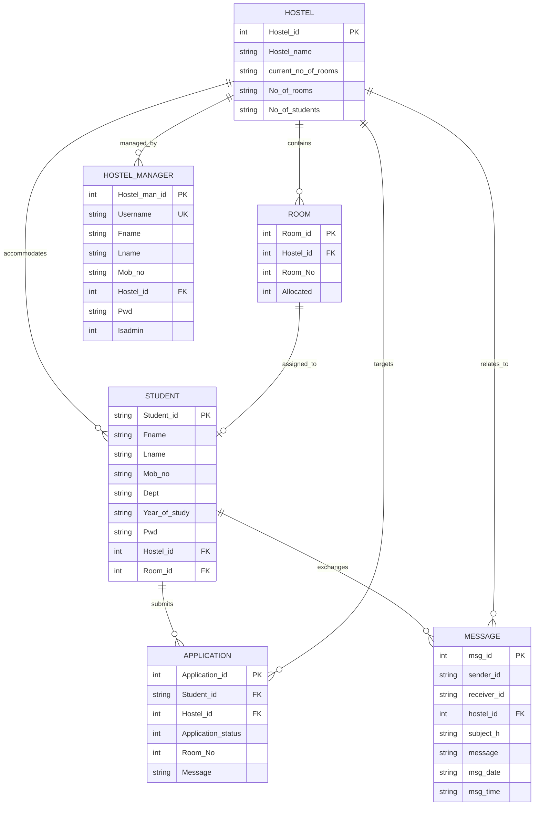

# NIT Calicut - Hostel Management System
## Technology Stack, Languages, and Architecture Specification

This document provides a comprehensive overview of the programming languages, frameworks, libraries, database engines, and architectural patterns utilized in the **Hostel Room Allocation and Management System**.

---

## 1. Programming Languages

| Language | Role / Layer | Primary Purpose |
| :--- | :--- | :--- |
| **JavaScript (ES6+)** | Backend (Node.js) & Frontend | Powers server routes, API endpoints, database wrappers, async UI controllers, and DOM manipulation. |
| **HTML5** | Frontend Presentation | Provides semantic page structuring, responsive forms, accessibility tags, and modal dialog containers. |
| **CSS3** | Frontend Styling & UX | Implements modern responsive layout (Grid & Flexbox), CSS custom properties (variables), and glassmorphic UI. |
| **SQL (SQLite3 Dialect)** | Data Persistence | Defines relational schemas, constraints, foreign keys, triggers, and transactional queries. |
| *PHP 7.x (Legacy)* | Archived (`legacy_php/`) | The original NIT Calicut DBMS course project codebase (preserved for reference). |

---

## 2. Core Technologies & Frameworks

### 2.1 Backend Stack (Server-Side)
- **Node.js (v18.x - v22.x)**: High-performance, asynchronous event-driven JavaScript runtime engine.
- **Express.js (v4.19.2)**: Minimalist web application framework for:
  - Routing RESTful API endpoints (`/api/student/*`, `/api/manager/*`, `/api/hostels`, etc.).
  - Serving static assets from the `public/` directory.
  - Applying security and cache-control headers (`Cache-Control: no-store`).
- **Bcrypt.js (v2.4.3)**: Industry-standard adaptive cryptographic hashing library with 10 salt rounds to securely hash and compare user passwords.
- **CORS (v2.8.5)**: Cross-Origin Resource Sharing middleware enabling flexible API accessibility.

### 2.2 Database & Storage Layer
- **SQLite3 (v5.1.7)**: Self-contained, serverless, zero-configuration relational database engine stored on disk at `data/hms.db`.
  - **WAL (Write-Ahead Logging)** mode enabled via `PRAGMA journal_mode = WAL` for superior concurrent read/write throughput.
  - **Foreign Key Enforcement** enabled via `PRAGMA foreign_keys = ON` ensuring strict relational integrity (`CASCADE` / `SET NULL`).
  - **Custom Async/Await Query Wrapper**: Promisified wrapper (`query.get`, `query.all`, `query.run`) eliminating callback hell.
- **Browser LocalStorage**: Client-side storage for maintaining user sessions across page reloads without cookies.

### 2.3 Frontend & Design System
- **Single Page Application (SPA) Architecture**: Dynamic DOM rendering without browser reloads.
- **Modern Vanilla CSS3**:
  - Curated design system using CSS Variables (`--color-primary`, `--glass-bg`, `--font-sans`, etc.).
  - Glassmorphic translucent cards with `backdrop-filter: blur(16px)` and subtle borders.
  - Fully responsive mobile-friendly layouts built with CSS Grid and Flexbox.
- **Google Web Fonts**:
  - **Outfit**: Modern geometric typeface for brand titles and prominent headings.
  - **Inter**: Clean, legible sans-serif font for data tables, form inputs, and body text.
- **FontAwesome 6.4.0**: Vector icon toolkit for intuitive dashboard metrics, room status badges, and action buttons.
- **Cache-Buster & Service Worker Deregistration**: Client-side kill-switch script that purges rogue offline caches and unregisters obsolete service workers.

---

## 3. Database Schema & Data Models



---

## 4. System Directory & Module Organization

```
Hostel-Management-System/
│
├── src/                          # Backend Application Logic
│   ├── server.js                 # Express server, authentication middleware & API endpoints
│   └── db.js                     # SQLite schema definitions, table migrations & seed data
│
├── public/                       # Frontend Web Application (SPA)
│   ├── index.html                # Semantic HTML layout, modals & cache-buster script
│   ├── style.css                 # Glassmorphic stylesheet, typography & responsive rules
│   └── app.js                    # Client state manager, auth handler & API communications
│
├── data/                         # Persistent Database Files
│   └── hms.db                    # Active SQLite database file
│
├── Documentation/                # Technical Documents & Specifications
│   ├── TECH_STACK_AND_ARCHITECTURE.md  # Detailed technology stack & architecture guide
│   ├── SDD.docx                  # Software Design Description
│   ├── SRS.docx                  # Software Requirements Specification
│   └── UserManual.docx           # End-user operational manual
│
├── legacy_php/                   # Archived NIT Calicut PHP/MySQL Codebase
│   ├── admin/                    # Legacy PHP admin scripts
│   ├── database/                 # Legacy MySQL dumps
│   ├── dumping/                  # Historical database dumps
│   ├── includes/                 # Legacy PHP header/footer includes
│   ├── templates/                # Legacy HTML/PHP templates
│   ├── web/                      # Legacy web assets
│   └── *.php                     # Historical PHP pages
│
├── package.json                  # Node.js project manifest, dependencies & scripts
└── README.md                     # Quickstart guide, port 5000 instructions & demo accounts
```

---

## 5. Security & Performance Features

1. **Password Protection**: All passwords (students, managers, and admins) are hashed with `bcryptjs` before being stored in SQLite. Passwords are never stored in plaintext.
2. **SQL Injection Defense**: All queries use parameterized statements (`?` placeholders) via the promisified SQLite wrapper, eliminating SQL injection vulnerabilities.
3. **Cache & Port Conflict Isolation**:
   - Runs on clean port `5000` to prevent collisions with other local developer servers (such as Next.js or Vite projects on port 3000).
   - Injected client-side cache cleaner and `Cache-Control: no-store` HTTP headers ensure users always see the latest application state.
4. **Relational Constraints**: Foreign key cascading (`ON DELETE CASCADE` and `ON DELETE SET NULL`) keeps the database synchronized if students or rooms are vacated or deleted.
